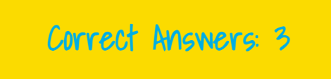
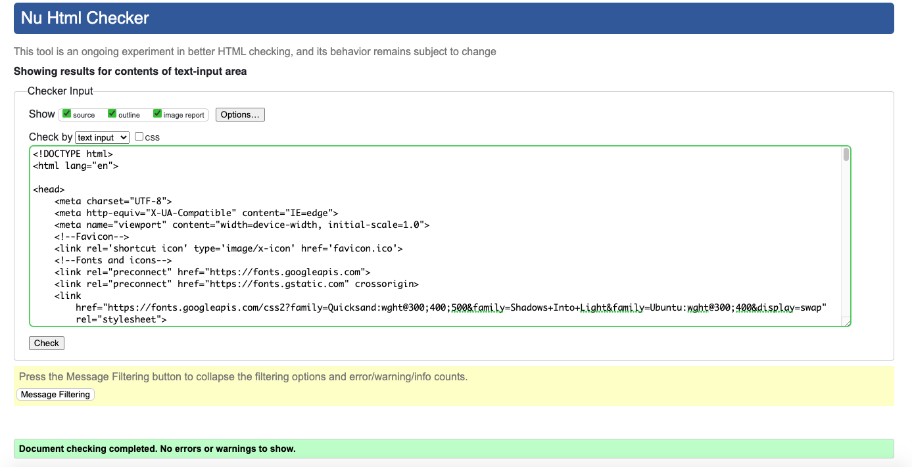

# Friends, The Quiz

This website is for all users who are fans of the sitcom, Friends, who watched the series and have good memories with it. The users can test their knowledge on the characters and the series in general as the website is offering a selection of quiz questions dedicated to each friends characters. It is a fun way for the user to refresh their memory of the topic. At the end of each quiz they can see their results, as well, how many points they received. 

Of course the game is designed to be easily used on any device and so to be inclusive. This means that the site needs to be responsive, allowing visitors to view it on any sized device without losing the quality of experience. The main focus of the site is to be engaging, colourful and motivating while providing real story-based questions and true answers to those based on Friends. 

[Link to my website](https://lilla-kavecsanszki.github.io/friends-quiz/)

[I Am Responsive](https://ui.dev/amiresponsive?url=https://lilla-kavecsanszki.github.io/friends-quiz/)

The business goals of this website are:

-	Provide high-quality questionnaires based on the sitcom
-   Excellent UX to keep potential clients on site long enough to discover all features and then invite their friends too 
    for a game, the sticky hamburger menu button is an excellent addition for an easier and hassle-free navigation throughout the website.

The customer goals of this website are:

-   Search for a fun site, where they can test their knowledge of the sitcom
-   A website where they can find a character based game, to be able to choose a selected quiz based on their 
    favourite character or have a different one for each friend. Not just a generalised Friends quiz like, on other websites. 

# Contents

- [User Experience (UX)](https://github.com/Lilla-Kavecsanszki/friends-quiz#user-experience-ux)
- [Ideal client](https://github.com/Lilla-Kavecsanszki/friends-quiz#ideal-client)
- [User stories](https://github.com/Lilla-Kavecsanszki/friends-quiz#user-stories)
- [Wireframes](https://github.com/Lilla-Kavecsanszki/friends-quiz#wireframes)
- [Accessibility](https://github.com/Lilla-Kavecsanszki/friends-quiz#accessibility)
- [Design](https://github.com/Lilla-Kavecsanszki/friends-quiz#design)
  - [Colour Scheme](https://github.com/Lilla-Kavecsanszki/friends-quiz#colour-scheme)
  - [Typography](https://github.com/Lilla-Kavecsanszki/friends-quiz#typography)
- [Languages Used](https://github.com/Lilla-Kavecsanszki/friends-quiz#languages-used)
- [Technologies Used](https://github.com/Lilla-Kavecsanszki/friends-quiz#technologies-used)
- [Features](https://github.com/Lilla-Kavecsanszki/friends-quiz#features)
  - [Home](https://github.com/Lilla-Kavecsanszki/friends-quiz#home)
  - [How to Play?](https://github.com/Lilla-Kavecsanszki/friends-quiz#how-to-play)
- [Deployment](https://github.com/Lilla-Kavecsanszki/friends-quiz#deployment)
- [Local Deployment](https://github.com/Lilla-Kavecsanszki/friends-quiz#local-deployment)
  - [How to Clone](https://github.com/Lilla-Kavecsanszki/friends-quiz#how-to-clone)
  - [How to Fork](https://github.com/Lilla-Kavecsanszki/friends-quiz#how-to-fork)
- [Testing](https://github.com/Lilla-Kavecsanszki/friends-quiz#testing)
  - [Manual Testing](https://github.com/Lilla-Kavecsanszki/friends-quiz#manual-testing)
  - [User Stories Testing](https://github.com/Lilla-Kavecsanszki/friends-quiz#user-stories-testing)
  - [Further Testing](https://github.com/Lilla-Kavecsanszki/friends-quiz#further-testing)
  - [Bugs](https://github.com/Lilla-Kavecsanszki/friends-quiz#bugs)
- [Credits](https://github.com/Lilla-Kavecsanszki/friends-quiz#credits)
  - [Content](https://github.com/Lilla-Kavecsanszki/friends-quiz#content)
  - [Media](https://github.com/Lilla-Kavecsanszki/friends-quiz#media)
  - [Acknowledgments and Code](https://github.com/Lilla-Kavecsanszki/friends-quiz#acknowledgments-and-code)
  - [Disclaimer](https://github.com/Lilla-Kavecsanszki/friends-quiz#disclaimer)

# User Experience (UX)

### Ideal client

The ideal client for this business is:

-	English speaking
-	Friends fan
-   A person who watched the series 
-   Individuals, couples, families, or groups

Visitors of this website search for:

-	A knowledgeable site, where they can find story-based questions and challenging, engaging answer options 

This website is the best way to help them achieve these goals because:

- Most other similar sites are limited in their quiz games to a general Friends quiz, while this website offeres individual questionnaires for each characters
- The website also offers true story-based question scenarios and 4 answers to choose from that are just challenging enough

This website:

-	Is easy to navigate due to its sticky hamburger menu button scrolls with the user on all pages.
-   Gives the customers options and access to useful and learnable information.
-   Gives the customers the information they need without overloading them or distracting them from their original ideas  
    or wishes.
-   Guides them and their curiosity to the goal of the website
-   Has social media site buttons in the footer, which open them up in new tabs in order to not distract the customers  
    away from the website but a great help for the developer to showcase her other projects and work.  

[Back to top](https://github.com/Lilla-Kavecsanszki/friends-quiz#contents)

### User stories

1.	As a viewer of the website, I want to easily navigate the site, so I can find what I need (most importantly, the 
    quiz efficiently.
2.	As a potential new visitor of the website, I want to understand what the game is about and its rules.
3.  As a viewer of the website, I want to be able to see my final result and progression in the meantime.
4.  As an interested observer and/or hiring manager, I want to be able to find the web developer and see other projects 
    from her on social media and industry relevant sites

[Back to top](https://github.com/Lilla-Kavecsanszki/friends-quiz#contents)

# Wireframes

Home page

How to play? page

[Back to top](https://github.com/Lilla-Kavecsanszki/friends-quiz#contents)

# Accessibility

Accessibility has been a very important point for me while designing the website.

Lighthouse testing for desktop and mobile has scored 100% for accessibility on both.

I used [A11y](https://color.a11y.com) the Color Contrast Accessibility Validator which determined that no colour contrast issues were found on any of the pages.

[Back to top](https://github.com/Lilla-Kavecsanszki/friends-quiz#contents)

# Design

### Colour Scheme

- Bright yellow #f8d649
- Very dark (mostly black) cyan #141c1e
- Dark moderate lime green #48a04f
- Bright red #ed3833
- Soft blue #44aedd
- Moderate violet #8f4ec4  
- Whitesmoke #f5f5f5

[My Colour Palette](https://colorkit.co/palette/f5f5f5-f8d649-48a04f-44aedd-8f4ec4-ed3833-141c1e/)

[Back to top](https://github.com/Lilla-Kavecsanszki/friends-quiz#contents)

### Typography

I used [Google Fonts](https://fonts.google.com/) to import the following fonts to the site.

The primary font used for the Quiz logo and character buttons is Shadows Into Light, this was chosen because I found this font to be the closest to the one displayed in the title of the series. Therefore the user associates straight away to the topic of the website, without much explanation. 

The secondary font used for the body is Ubuntu which was selected for its clear readability, that works well with Shadows Into Light to maintain the cheerful and fun outcome.

I also chose a third font for the footer text, Quicksand, as I wanted to implement a much lighter font for that purpose, not to be distractive for the user.

[Back to top](https://github.com/Lilla-Kavecsanszki/friends-quiz#contents)

# Languages Used

HTML, CSS and Javascript were used to complete this project.

[Back to top](https://github.com/Lilla-Kavecsanszki/friends-quiz#contents)

# Technologies Used

- Microsoft Word was used to create the wireframes 
- [Font Awesome](https://fontawesome.com/) was used for all icons on the pages
- Github was used to store all files for this website
- Gitpod was used to create and edit all original code
- Google Chrome Developer Tools was used for debugging and testing with Lighthouse
- [Google Fonts](https://fonts.google.com/) was used to import both fonts for use on the site
- [Favicon Generator](https://favicon.io/favicon-generator/) was used to create personalised favicon for the site

[Back to top](https://github.com/Lilla-Kavecsanszki/friends-quiz#contents)

# Features

The Friends Quiz website includes 2 pages; Home and the instruction page; 'How to play?'. All the pages are accessible through the hamburger menu shown at the top of the screen at all times. At the end of each game there is an extra 'Home' button to return to the Home page and so the user can choose a character again if they wish to start a new game. 

The pages include:
A navigation hamburger bar that allows the customers to navigate to each of the main pages of the site. The hamburger menu is fixed so it will follow the customer scrolling down the pages, giving them easier access to navigate again. Upon hovering over each of the hamburger menu links they'll also be changing their backgrounds to show the viewer where they are clicking. 

A footer is displayed at the bottom of each page which displays the contact information of the web developer, Copyright information with a disclaimer and links to LinkedIn and Github for the viewers to be able to get in contact with the developer.

#### Home

The Home page features a logo image, that instantly makes the theme of the website understandable to the user. It has the header - a navigation hamburger menu displayed as a fixed feature. The logo image also has a cover text on it with a text that explains the purpose of the website straight away. The purpose of these elements is to give a great first impression on arriving at the website, with the straight forward suggestion to the purpose itself.  

After the log/hero image, there is an encouraging text that is a button at the same time, taking the user to the section where they can start the game. When this link is clicked, the soundtrack of the sitcom starts, giving extra dynamics to the page. The text starts with a common speaker icon to make sure that the user understands that it will be noisy, in case they are at a place where that would be inappropriate or simply doesn't want to listen any audio at the moment. There are also 2 buttons to control the audio underneath. In case the user doesn't want to listen the music, they can stop it straight away, or also restart it. The buttons are edited font icons, featuring the common 'play' and 'stop' signs for the sake of common understanding of what those buttons are for. The also zoom out and change colours when the user hover over them to see which button is clicked.   

After this section there are 6 buttons with the name of each characters on them. When the user clicks on them, the buttons will take them onto the next 'window' of the page, which is a personalized quiz based on the choosen character.

After clicking on the buttons the second 'window' will be displayed and the first one with the audio buttons and the character choosing buttons will be invisible. (There is a third 'window' too, that one is also invisible at this stage.)
With that the quiz starts, with 10 questions and 4 multiple choice answers designed for the 6 characters each.

This window also features a progress bar on the top left corner with blue color. With this the user can keep track which question they are at out of 10 and so their progess.

On the same line with the progress bar, on the top right corner there is a score counter with green color. The user can keep track of their scores, or correct answers.

Under the progress bar and the score counter there is the quiz itself, displaying 10 different questions and 4 multiple choice answer to each questions, respectively to the 6 characters also. The questions come up in a random order, so each round feels a little bit different.

When the user finishes with all 10 questions the third 'window', the final-results-window, becomes visible, and the other two invisible.

First the final point count gets displayed

Then a text also makes it understandable that the quiez has ended, then the relevant message gets displayed too. This message is based on the achieved points by the user. 

And lastly a home button that is the same violet colour as the hamburger menu, suggesting that it is for navigation, as well. The user can navigate back to the first window to choose a character again, and restart if wishes to. 

#### How to Play? 

On the top the title is displayed, confirming that the user is on the correct page. 

Underneath there is an encouraging paragraph then the explanation of website, what it is about with the instructions along some references from the series.

Under the instructions section there is an animated Thanksgiving turkey with sunglasses. This is a funny reference from the series to set the mood for the webpage.

[Back to top](https://github.com/Lilla-Kavecsanszki/friends-quiz#contents)

# Deployment

The On The Sunny Side website is deployed using Github Pages, this was done by:

1. Login to Github
2.	Navigate to the account Lilla-Kavecsanszki, and locate the On-The-Sunny-Side repository
3.	In On-The-Sunny-Side repository click on the Settings tab
4.	In the Code and Automation subheading in the sidebar click on Pages
5.	Under Build and Deployment find the Source section, set the source to deploy from a branch, and set this branch to
main, and the folder option to /root
6.	Click save, wait a few minutes and On The Sunny Side website is now deployed at the URL displayed

[Back to top](https://github.com/Lilla-Kavecsanszki/friends-quiz#contents)

# Local Deployment

[Back to top](https://github.com/Lilla-Kavecsanszki/friends-quiz#contents)

## How to Clone

Locate the main page of Friends-Quiz repository, click the Code button to the left of the green Gitpod button, then choose Local. Copy the URL of the repository, you can click on headings for HTTPS, SSH, and Github CLI to find their individual links. Open your own terminal in your editor and change the current working directory to the location of where you want the cloned directory to be. In the terminal type git clone, and then paste the URL you copied from Friends-Quiz repository page. Press enter to complete.

[Back to top](https://github.com/Lilla-Kavecsanszki/friends-quiz#contents)

## How to Fork

Locate the main page of Friends-Quiz repository. Click the fork button in the top right of the screen, between the watch, and the star buttons.

[Back to top](https://github.com/Lilla-Kavecsanszki/friends-quiz#contents)

# Testing

W3C CSS Validator result on the css page

W3C HTML Validator result on the Home page

W3C HTML Validator result on the How to play page

JS Validator results on the js file

[Back to top](https://github.com/Lilla-Kavecsanszki/friends-quiz#contents)

## Manual Testing

**Home Page:**

**Hamburger menu:** Go to the "Home" page from a desktop. Change the screen size from desktop to tablet to verify that the hamburger menu is naturally responsive and works as expected, as unfolds and drops down with no issues. Click on each navigation menu item and verify that it links to the correct page. Hover over the menu buttons and verify the hover colour change work as expected.

**Logo image:** Go to the "Home" page from a desktop. Reduce and expand the width of the window to confirm that the image responds correctly and looks good.

**Cover-text on top of the logo image:** Go to the "Home" page from a desktop. Reduce and expand the width of the window to confirm that the text in this section responds correctly and looks good on all device widths. I had to adjust positioning for this on smaller screen sizes to keep its original place and therefore a responsive reaction. 

**The window container (#main-window):** Go to the "Home" page from a desktop. Reduce and expand the width of the window to confirm that the texts and other elements in this sections respond correctly and look good on all device widths.

**Let's start link:** Reduce and expand the width of the window to confirm that the text responds correctly and looks good on all device widths. Click on the link item and verify that it links to the correct part of the page and takes the user to the character buttons to be able to choose one. Hover over the link and verify the hover colour change work as expected. Click on the link item and the audio starts as expected. The speaker icon at the beginning warns the user that the link will go noisy.

**Audio control buttons:** Reduce and expand the width of the window to verify that the icon buttons display behave and center as expected and that they look good on all device widths. Hover over the buttons and verify the hover colour change work as expected as well as the zoom out animation. Click the stop button and the audio stops. Click the play button and the audio carries on from where it was stopped beforehand. If the audio finished, clicking the play button would start over the audio from the beginning.

**Character buttons:** Reduce and expand the width of the window to verify that the character buttons display behave and center as expected and that they look good on all device widths. I had to adjust the flex-direction to column for this on smaller screen sizes to move the buttons under each ohter for readability and a responsive reaction. Hover over the buttons and verify the hover colour change work as expected. Click any of the character buttons and their relevant quiz game will start and the "quiz-window" gets visible to display the quiz. I confirm that after this step the "choosing-window" or the "final-results-window" are not visible. 

**"quiz-window":**
**Question:** Reduce and expand the width of the window to confirm that the text responds correctly and looks good on all device widths. A new question pops up 800 milliseconds after the previous answer has been choosen. 

**Answer choice container bars:** Reduce and expand the width of the window to confirm that the bars respond correctly and look good on all device widths. Four multiple choice answers display at the same time with the question. Hover over the bars and verify the hover zoom-out works as expected. Click on the correct answer and verify the colour change to green works as expected. Click on the three wrong answers and verify the colour change to red works as expected. Click on any answers at the tenth question and verify that the "final-results-window" gets visible to display the final result of the quiz. I confirm that after this step the "choosing-window" or the "quiz-window" are not visible. 

**Score counter:** Reduce and expand the width of the window to confirm that the score counter responds correctly, keeps its position and look good on all device widths. Click on the correct answer (answer choice container bars) and verify the score adds 1 point to its previous state. Start a new quiz for the same or different character and verify that the Score number goes back to 0 as a starting value. 

**Progress bar:** Reduce and expand the width of the window to confirm that the progress bar responds correctly, keeps its position and looks good on all device widths. Click on any of the answers (answer choice container bars) and verify the progress bar adds 1 to the question counter out of 10 and bar's colour-fill grows respectively also based on the percentage. Start a new quiz for the same or different character and verify that the progress bar resturns to its starting positions, that is question 1.

**"final-results-window":** 
Final result points: Reduce and expand the width of the window to verify that the text display behaves and centers as expected and that it looks good on all device widths. The number shows the correct result that is the same number as the score counter point after the tenth question was answered. 

**Encouragnig message:** Reduce and expand the width of the window to verify that the texts display behave and center as expected and that they look good on all device widths. I confirm that the first sentence stays the same at every rounds but the second, encouraging message changes to three different messages based on the achieved final points. Go through the quiz and verify that the "End of the quiz!\n Hooray !! You are a true friend!" gets displayed if the user's final point was 8 or higher. The "End of the quiz!\n Not bad!" message gets displayed if the user's final point was 5 or higher. And the "End of the quiz!\n Better Luck next time!" message gets displayed if the user's final point was 4 or smaller.

**Home button:** Reduce and expand the width of the window to verify that the button display behaves and centers as expected and that it looks good on all device widths. Hover over the button and verify the hover zoom out animation work as expected. Click on the link item and verify that it links to the correct part of the page and takes the user back to the top of the first stage of the home page with the "choosing-window" displayed, to be able restart and choose a character again. I confirm that after this step the "final-results-window" or the "quiz-window" are not visible.

**Footer:** Click on each social media icon to confirm they open in a separate tab for their links. Reduce and expand the width of the window to verify that the footer is responsive and looks good on all device widths. I had to adjust padding-bottom for this on smaller screen sizes to keep enough space between the lines for readability and therefore a responsive reaction.

**How to play? page:**

**Hamburger menu:** Repeat the verification steps done for the navbar on the Home page. Confirm that the hamburger menu code is identical on all HTML pages.

**Instructions:** Go to the "How to play?" page from a desktop. Reduce and expand the width of the window to confirm that the title and all paragraph texts responds correctly, centers as expected and looks good on all device widths. I had to adjust font size and padding-top of the title for this on smaller screen sizes.

**Turkey:** Go to the "How to play?" page from a desktop. Reduce and expand the width of the window to verify that the image display behaves and centers as expected and that it looks good on all device widths. The shake animation also works as expected at all times. 

**Footer:** Repeat the verification steps done for the footer on the Home page. Confirm that the footer code is identical on all HTML pages.

Review all functionality and responsiveness on my mobile phone and tablet for all pages.

[Back to top](https://github.com/Lilla-Kavecsanszki/friends-quiz#contents)

## User Stories Testing 

1.	As a viewer of the website, I want to easily navigate the site, so I can find what I need (most importantly, the 
    quiz efficiently.

    - Regardless of which page the viewer is on, they can easily find and use the navigation bar, it also stays visible and on top of the screen even while scrolling.

    

2.	As a potential new visitor of the website, I want to understand what the game is about and its rules.

    - 

    

3.  As a viewer of the website, I want to be able to see my final result and progression in the meantime.

    - 
    
    

4.  As an interested observer and/or hiring manager, I want to be able to find the web developer and see other projects 
    from her on social media and industry relevant sites

    -  
    
    .  

[Back to top](https://github.com/Lilla-Kavecsanszki/friends-quiz#contents)

## Further testing

I asked friends and family to look at the site on their devices and browsers and report any issues they find. Height of the logo image was adjusted as a result of this on the Home page and also in media queries respectively. It was covering a few buttons in the middle of page, therefore those didn't work until the issue was resolved. 

[Back to top](https://github.com/Lilla-Kavecsanszki/friends-quiz#contents)

## Bugs

[Back to top](https://github.com/Lilla-Kavecsanszki/friends-quiz#contents)

# Credits

## Content

The text for the 'How to Play?' page and the content for the quiz games were a creative work of Georgina Kavecsanszki. 

[Back to top](https://github.com/Lilla-Kavecsanszki/friends-quiz#contents)

## Media

The images that are used on this site were obtained from;

https://www.kindpng.com/imgv/hJiJhx_phoebe-buffay-rachel-green-ross-geller-social-group/
https://stock.adobe.com/uk/search?k=Friends+sitcom&search_type=usertyped

The soundtrack audio that is used on the website was obtained from;

https://archive.org/details/tvtunes_31736

[Back to top](https://github.com/Lilla-Kavecsanszki/friends-quiz#contents)

## Acknowledgments and Code

I received inspiration for this project from my sister's and friends' as well as my own obsessions with the sitcom and I have also checked out works of other students for scope and what's best practice for a Mile stone project 2. 

turkey animation 
https://www.w3schools.com/howto/howto_css_shake_image.asp#:~:text=Learn%20how%20to%20shake%2Fwiggle%20an%20image%20with%20CSS.,last%20for%200.5%20seconds%20%2A%2F%20animation%3A%20shake%200.5s%3B

hamburger menu

https://codepen.io/andreykrokhin/pen/mGEqja

The quiz

The below YouTube video and websites have been used to understand the logic of building a quiz with Javascript. They were also the primary source of encouragement to start off this project.

https://www.youtube.com/watch?v=f4fB9Xg2JEY

https://www.howtogeek.com/devops/using-arrow-functions-in-javascript/#:~:text=An%20arrow%20function%20in%20JavaScript%20is%20a%20terser,Arrow%20functions%20were%20added%20with%20ES6%20in%202015.

https://www.w3schools.com/jsref/jsref_forEach.asp

https://www.sitepoint.com/simple-javascript-quiz/

https://www.w3schools.com/jsref/met_win_settimeout.asp

Flipping panels (windows)
https://www.w3schools.com/jsref/prop_style_display.asp

Using buttons and audio
https://stackoverflow.com/questions/51572489/playing-sound-on-click-event-with-pure-javascript

How to add table of content to README file
https://www.setcorrect.com/portfolio/work11/#:~:text=The%20idea%20was%20to%20use%20Markdown%20bulleted%20lists,bulleted%20%28unordered%29%20list%20in%20Markdown%3A%20%2A%20List%20item

[Back to top](https://github.com/Lilla-Kavecsanszki/friends-quiz#contents)

I also would like to say a big thank you to my mentor Elaine Roche who guided me through this project and gave me the idea of flipping windows and the nested array to keep the file numbers to the minimum after I arrived with roughly 15 files to our second session, as well as some UX tips!

## Disclaimer

This website is for educational use only.

[Back to top](https://github.com/Lilla-Kavecsanszki/friends-quiz#contents)